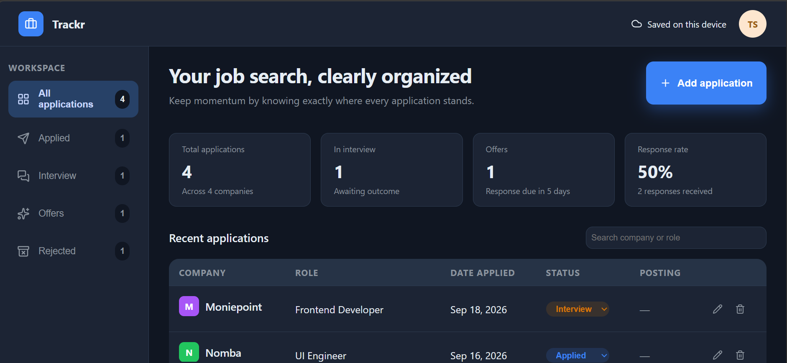

# Trackr

A job application tracker built with React, TypeScript, and vanilla CSS — designed to keep track of every application, interview, and offer in one clear, organized place.

**Live site:** https://job-application-tracker-chi-sand.vercel.app



## Features

- Add, edit, and delete job applications
- Track status through four stages: Applied, Interview, Offer, Rejected — editable directly from the table
- Search by company or role, and filter by status
- Auto-calculated follow-up reminders and response-due countdowns, based on how long an application has sat without an update
- Data persists locally via `localStorage` — no backend required
- Fully responsive: a data table on desktop, an icon-only sidebar on tablet, and a card-based layout with a slide-out menu on phone
- A designed empty state for first-time visitors, with a one-click "load sample data" option to explore the app

## Tech stack

- React + TypeScript
- Vite
- Vanilla CSS (CSS custom properties for theming)
- [lucide-react](https://lucide.dev/) for icons

## Running it locally

```bash
git clone https://github.com/SADATARE/job-application-tracker.git
cd job-application-tracker
npm install
npm run dev
```

Then open `http://localhost:5173` in your browser.

## Project structure
```
src/
├── components/   # UI components, each with its own CSS file
├── types/        # Shared TypeScript types
├── utils/        # Helper functions (date formatting, follow-up logic, storage, etc.)
├── App.tsx       # Main application state and layout
```

## Possible future additions

- A drag-and-drop kanban board view, grouped by status
- A light/dark theme toggle

## Author

Built by Sada Tare as a personal project.